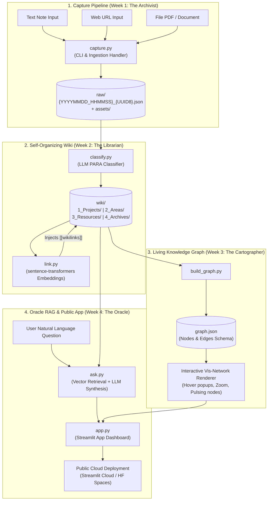

# System Architecture: SecondSelf — Personal AI Second Brain

## Executive Summary & System Vision

**SecondSelf** is a self-organizing personal knowledge engine that transforms scattered inputs (text notes, web URLs, PDFs, local documents) into an interconnected knowledge base. It categorizes notes using the **PARA Method** (*Projects, Areas, Resources, Archives*), auto-links related items using dense vector embeddings, visualizes knowledge as a force-directed interactive node graph, and provides grounded natural-language Q&A (RAG) over accumulated personal notes.

---

## 1. High-Level Architecture Diagram



---

## 2. Subsystem Technical Specifications

### 2.1 Layer 1: Ingestion & Storage Engine (`capture.py`)
- **Objective**: Single unified command capturing text notes, web URLs, and local files into an append-only `raw/` vault with timestamp and unique ID metadata.
- **Supported Modalities**:
  - `note`: Plain text string or stdin capture.
  - `link`: Web URL fetched via `requests` + `trafilatura` / `beautifulsoup4` to extract article title, clean Markdown body, and meta headers.
  - `file`: PDF / text / markdown / document files. PDF text extracted via `pdfplumber` / `pypdf`, original file saved to `raw/assets/`.
- **Raw Data Schema (`raw/{YYYYMMDD_HHMMSS}_{UUID8}.json`)**:
  ```json
  {
    "id": "raw_20260805_a1b2c3d4",
    "timestamp": "2026-08-05T00:59:00+05:30",
    "type": "note | link | file",
    "source": "CLI string / URL / file path",
    "title": "Extracted or Generated Title",
    "raw_content": "Full extracted text content payload...",
    "attachment": {
      "filename": "document.pdf",
      "stored_path": "raw/assets/20260805_a1b2c3d4_document.pdf",
      "mime_type": "application/pdf",
      "size_bytes": 1048576,
      "sha256": "e3b0c44298fc1c149afbf4c8996fb92427ae41e4649b934ca495991b7852b855"
    }
  }
  ```

### 2.2 Layer 2: PARA AI Classification & Embeddings (`classify.py` & `link.py`)
- **2.1 Auto-Classify (The Sorting Hat - `classify.py`)**:
  - Sends raw content payload to LLM (Groq / Llama 3 / Gemini).
  - Categorizes into PARA methodology:
    - `1_Projects/`: Active efforts with a specific goal and deadline.
    - `2_Areas/`: Key ongoing duties and responsibilities.
    - `3_Resources/`: Reference topics, research notes, interest areas.
    - `4_Archives/`: Inactive notes.
  - Generates Markdown file with YAML frontmatter saved to `wiki/{category}/{slug}.md`.
- **2.2 Auto-Link Related Notes (Connect the Dots - `link.py`)**:
  - Computes dense vector embeddings using `sentence-transformers/all-MiniLM-L6-v2` (384 dimensions).
  - Performs pairwise Cosine Similarity search across all notes in `wiki/`.
  - For pairs with similarity score $\ge 0.65$, appends bidirectional wikilinks (`[[Related Note Title]]`) under a `## Related Knowledge` section.

### 2.3 Layer 3: Knowledge Graph Model & Visualizer (`build_graph.py` & Graph UI)
- **3.1 Graph Data Model Builder (`build_graph.py`)**:
  - Parses all `.md` files in `wiki/`.
  - Extracts nodes (notes, categories, tags) and edges (explicit wikilinks + vector similarity links).
  - Exports structured `graph.json`:
    - **Nodes**: `{ "id": slug, "label": title, "group": para_category, "summary": summary, "tags": tags }`.
    - **Edges**: `{ "from": source_slug, "to": target_slug, "type": "explicit | semantic", "weight": similarity_score }`.
- **3.2 Interactive Visualization**:
  - Renders graph using `vis-network` (via PyVis / HTML canvas inside Streamlit).
  - Color-coded node pulsing visual feedback based on PARA category:
    - 🔵 Projects (Active)
    - 🟢 Areas (Responsibility)
    - 🟡 Resources (Reference)
    - ⚪ Archives (Inactive)
  - Features hover popups displaying note content previews, zoom, pan, and force-directed drag physics.

### 2.4 Layer 4: Oracle RAG Engine & Streamlit Application (`ask.py` & `app.py`)
- **4.1 Retrieval-Augmented Q&A (`ask.py`)**:
  - Vector search embeds user question and retrieves top $k=3..5$ matching note passages from `wiki/`.
  - Passes context + question to LLM with instruction to synthesize a grounded answer strictly using the user's notes, including explicit source file citations.
- **4.2 Streamlit Web Application (`app.py`)**:
  - Single web application hosting:
    - Panel 1: **Living Brain Visualizer** (interactive vis-network graph component).
    - Panel 2: **Ask Your Brain** (search bar, answer streaming, source citation drawer).
    - Panel 3: **Quick Capture Bar** (note/link/file ingestion directly from UI).
- **Public Cloud Deployment**:
  - Deployable on Streamlit Community Cloud / HuggingFace Spaces / Render with managed secrets (`GROQ_API_KEY`, `GEMINI_API_KEY`).

---

## 3. Recommended Repository Structure

```directory
secondself/
├── raw/                         # Week 1: Raw captured files JSON
│   └── assets/                  # Binary attachments (PDFs, images)
├── wiki/                        # Week 2: Classified PARA notes
│   ├── 1_Projects/
│   ├── 2_Areas/
│   ├── 3_Resources/
│   └── 4_Archives/
├── src/                         # Module source code
│   ├── __init__.py
│   ├── capture.py               # Week 1 capture CLI script
│   ├── classify.py              # Week 2 PARA classifier
│   ├── link.py                  # Week 2 vector embedding auto-linker
│   ├── build_graph.py           # Week 3 nodes/edges graph builder
│   └── ask.py                   # Week 4 RAG retrieval and synthesis engine
├── static/                      # HTML graph visualization templates
├── graph.json                   # Week 3 exported graph data
├── app.py                       # Week 4 Streamlit web UI
├── ProblemStatement.md          # Original problem statement
├── architecture.md              # System design document (This file)
├── Implementation-plan.md       # Phase-wise implementation plan
├── edge-case.md                 # Corner scenarios & edge cases
├── requirements.txt             # Python dependencies
└── README.md                    # Project documentation
```

---

## 4. Weekly Milestone & Deliverables Matrix

| Week | Milestone | Core Deliverable | Badge | Acceptance Criteria |
| :--- | :--- | :--- | :--- | :--- |
| **Week 1** | **The Archivist** | Ingestion script saving notes, links, and files to `raw/` with timestamp + unique ID. Tested on 10+ real items. | 🏅 The Archivist | `raw/` & `wiki/` exist; single command captures note, link & file; 10+ real items captured. |
| **Week 2** | **The Librarian** | LLM PARA classification to `wiki/` + local embedding similarity auto-linking (`[[wikilink]]`). Tested on 15+ items. | 🏅 The Librarian | Auto category/tags/summary; PARA organized `wiki/`; embeddings auto-link related notes. |
| **Week 3** | **The Cartographer** | Graph data model script generating `graph.json` + interactive force-directed graph UI (vis-network) with hover popups. | 🏅 The Cartographer | `graph.json` exporter; interactive force-directed graph; hover previews note content; drag + zoom. |
| **Week 4** | **The Oracle** | RAG `ask()` Q&A synthesis + Streamlit UI combining graph and search, deployed to public URL. | 🏅 The Oracle | Grounded `ask()` response; Streamlit app with graph & search; public live URL. |
