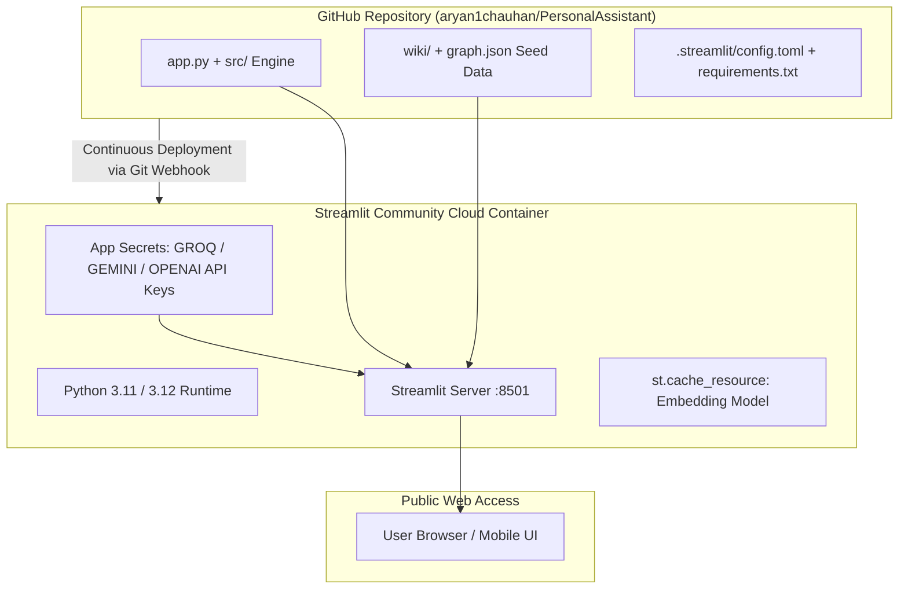

# Deployment Plan: SecondSelf on Streamlit Community Cloud

This guide provides an end-to-end blueprint for deploying the **SecondSelf — Personal AI Second Brain** application to **Streamlit Community Cloud** (and containerized alternatives).

---

## 1. Architecture & Deployment Overview



### Deployment Targets
- **Primary**: [Streamlit Community Cloud](https://share.streamlit.io/) (Free, native integration with GitHub, automatic HTTPS, CI/CD on git push).
- **Secondary / Backup**: Hugging Face Spaces (Streamlit SDK) or Docker on Render / Railway.

---

## 2. Pre-Deployment Readiness Checklist

Before triggering the deployment, verify the following prerequisites:

- [x] **Core Pipeline Verified**: All 118 unit & integration tests passing (`pytest`).
- [ ] **Repository Pushed to GitHub**: `main` branch up to date on `https://github.com/<username>/<repo>`.
- [ ] **Initial Knowledge Brain Seeded**: Ensure `wiki/` notes and pre-generated `graph.json` are committed so the deployed app boots with an active visual graph.
- [ ] **Streamlit Configuration**: Add `.streamlit/config.toml` for theme consistency and performance.
- [ ] **Secrets Mapping**: Ensure API keys (`GROQ_API_KEY`, `GEMINI_API_KEY`, `OPENAI_API_KEY`) are ready in TOML format for Streamlit Cloud's Secrets Manager.
- [ ] **Memory Footprint Checked**: Memory usage optimized to stay comfortably within the Streamlit Free Tier limit (~1 GB RAM).

---

## 3. Configuration & Asset Preparation

### 3.1 Streamlit App Configuration (`.streamlit/config.toml`)
Create `.streamlit/config.toml` to lock in the dark theme and optimize server parameters:

```toml
[theme]
base = "dark"
primaryColor = "#38bdf8"
backgroundColor = "#0b0f19"
secondaryBackgroundColor = "#151c2c"
textColor = "#cbd5e1"
font = "sans serif"

[server]
headless = true
enableCORS = false
enableXsrfProtection = true
maxUploadSize = 25

[browser]
gatherUsageStats = false
```

### 3.2 Secrets Synchronization in `app.py`
Streamlit Cloud injects secrets via `st.secrets`. Ensure `app.py` syncs them to `os.environ` so backend modules (`src/classify.py`, `src/ask.py`) access them seamlessly:

```python
# Synchronize Streamlit secrets to os.environ for backend modules
if hasattr(st, "secrets"):
    for key in ["GROQ_API_KEY", "GEMINI_API_KEY", "OPENAI_API_KEY"]:
        if key in st.secrets and key not in os.environ:
            os.environ[key] = st.secrets[key]
```

### 3.3 Dependencies Optimization (`requirements.txt`)
Verify `requirements.txt` includes all runtime dependencies:

```text
pydantic>=2.0.0
python-dotenv>=1.0.0
click>=8.1.0
rich>=13.0.0
requests>=2.31.0
beautifulsoup4>=4.12.0
trafilatura>=1.6.0
pdfplumber>=0.10.0
pypdf>=3.15.0
sentence-transformers>=2.2.2
torch>=2.0.0
google-genai>=0.1.0
groq>=0.4.0
openai>=1.0.0
streamlit>=1.30.0
pyvis>=0.3.2
networkx>=3.0
tenacity>=8.2.0
```

---

## 4. Step-by-Step Streamlit Cloud Deployment Guide

### Step 1: Push Project to GitHub
1. Ensure working directory is clean:
   ```bash
   git status
   ```
2. Commit `.streamlit/config.toml` and seeded graph data:
   ```bash
   git add .streamlit/config.toml wiki/ graph.json requirements.txt app.py
   git commit -m "chore: prepare repository for Streamlit Cloud deployment"
   git push origin main
   ```

### Step 2: Connect to Streamlit Community Cloud
1. Go to [share.streamlit.io](https://share.streamlit.io/).
2. Log in using your GitHub account (authorizing repository access).
3. Click **"Create app"** (or **"New app"**).

### Step 3: Configure App Settings
Fill in the deployment form:
- **Repository**: `aryan1chauhan/PersonalAssistant` (or your repository path)
- **Branch**: `main`
- **Main file path**: `app.py`
- **App URL (optional)**: Custom subdomain (e.g., `secondself-brain.streamlit.app`)

### Step 4: Configure App Secrets
1. Click **"Advanced settings..."** before deploying (or go to **App Settings > Secrets** after creating).
2. Paste the following TOML configuration into the **Secrets** editor:

```toml
# Streamlit Community Cloud Secrets for SecondSelf
GROQ_API_KEY = "gsk_your_groq_api_key_here"
GEMINI_API_KEY = "AIzaSy_your_gemini_api_key_here"
OPENAI_API_KEY = "sk-proj_your_openai_api_key_here"
```

3. Click **"Save"**.

### Step 5: Launch & Monitor Build
1. Click **"Deploy!"**.
2. Streamlit Cloud will:
   - Spin up a Debian Linux container.
   - Install Python dependencies from `requirements.txt`.
   - Download the `sentence-transformers/all-MiniLM-L6-v2` embedding weights (~90MB, cached in container memory).
   - Launch the Streamlit server.
3. Watch the build log stream in the right-side drawer to verify error-free execution.

---

## 5. Memory & Performance Optimization

Streamlit Community Cloud free tier instances have a **1 GB RAM limit**. The following measures prevent Out-Of-Memory (OOM) crashes:

1. **Lightweight Embedding Model**:
   - `sentence-transformers/all-MiniLM-L6-v2` consumes ~120 MB RAM in memory and ~90 MB on disk.
2. **PyTorch CPU-Only Mode**:
   - On Linux containers, PyTorch runs in CPU mode without CUDA overhead.
3. **Resource Caching**:
   - Embedding models and precomputed embeddings are cached using `@st.cache_resource` to avoid re-instantiation on every tab change or user interaction.
4. **Precomputed Graph Serialization**:
   - `graph.json` is pre-built from `wiki/` notes during repo build, eliminating the need to rebuild the full graph on every cold start.

---

## 6. Data Persistence Considerations

> [!IMPORTANT]
> **Ephemeral Storage on Streamlit Cloud:**
> Streamlit Cloud containers use ephemeral storage. Any new note captured via Tab 3 (*Quick Capture*) will be stored in the running container's `raw/` and `wiki/` directories for the duration of the container session, but will reset if the app restarts or sleeps.

### Recommended Approaches for Persistence:
1. **Curated Showcase / Second Brain Demo (Default)**:
   - Commit your personal `wiki/` notes, `raw/` captures, and `graph.json` directly to Git.
   - The deployed app functions as an always-accessible interactive portfolio and search engine over your curated second brain.
2. **Bidirectional Git Sync (Advanced)**:
   - Use a GitHub Personal Access Token (`GITHUB_TOKEN` in secrets) with `GitPython` to commit new captures directly back to the GitHub repository when submitted via Quick Capture.
3. **Cloud Storage Backend (Optional Future Enhancement)**:
   - Sync captures to Supabase / AWS S3 / Google Cloud Storage buckets for long-term multi-user persistence.

---

## 7. Post-Deployment Verification & Smoke Test Plan

Once deployed at `https://<your-app-name>.streamlit.app`, execute the following smoke tests:

| Test ID | Area | Verification Steps | Expected Result |
| :--- | :--- | :--- | :--- |
| **ST-01** | **App Boot** | Load the public URL in a fresh browser session. | App loads without 500 error; Header and 3 tabs render with dark theme. |
| **ST-02** | **Tab 1: Visualizer** | Open *Living Brain Visualizer*, interact with nodes (drag, zoom, click). | Force-directed graph renders with color-coded PARA nodes and popups on hover. |
| **ST-03** | **Tab 2: RAG Search** | Ask: *"What are the key goals and projects documented in my second brain?"* | Streaming response generated using retrieved notes, with source citation drawer expanding. |
| **ST-04** | **Tab 3: Quick Capture** | Ingest a quick test note: *"Test Cloud Note: Reviewing cloud deployment"*. | Capture saves to `raw/`, classifies into PARA, and updates local state. |
| **ST-05** | **Mobile Responsiveness** | Open app URL on a mobile device / narrow viewport. | Sidebar collapses cleanly, graph adapts, and chat input remains accessible. |

---

## 8. Troubleshooting Common Deployment Issues

| Issue / Error | Root Cause | Solution |
| :--- | :--- | :--- |
| **`ModuleNotFoundError: No module named 'src'`** | Python execution path does not include workspace root on Linux. | Handled via `sys.path.insert(0, str(Path(__file__).resolve().parent))` in `app.py`. |
| **`ResourceExhausted / OOM Killed`** | Large dependencies or excessive batch embedding sizes exceed 1GB container RAM. | Ensure `all-MiniLM-L6-v2` is used (not large 7B LLMs locally); LLM calls are routed via external APIs (Groq / Gemini / OpenAI). |
| **`KeyError: 'GROQ_API_KEY'`** | Secrets not configured in Streamlit Cloud dashboard. | Add `GROQ_API_KEY` under **App Settings > Secrets** in TOML format. |
| **PyVis iframe displays blank white box** | Mixed content blocking or HTML file path resolution on Linux. | Use Streamlit `components.html(html_string, height=750)` with UTF-8 raw string injection. |
| **Charmap encoding errors on text output** | Windows cp1252 vs Linux UTF-8 differences. | UTF-8 wrappers and explicit `encoding="utf-8"` are enforced in all file read/writes across `src/`. |

---

## 9. Next Steps

1. Create `.streamlit/config.toml` in the repository.
2. Ensure `app.py` has the secrets synchronization block.
3. Push changes to GitHub:
   ```bash
   git push origin main
   ```
4. Deploy the app on [share.streamlit.io](https://share.streamlit.io/) and configure secrets.
